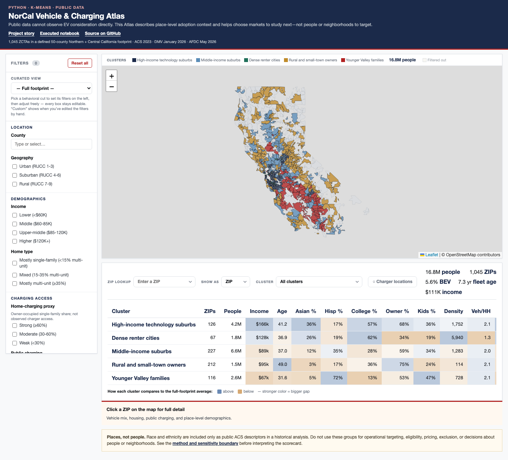

# NorCal Vehicle & Charging Atlas

**A geodemographic analysis using Python, K-means clustering, and an interactive public-data map.**

[Explore the Atlas](https://lgoyal13.github.io/norcal-atlas/) · [Read the executed notebook](notebooks/NorCal_Atlas_Geodemographic_Segmentation.ipynb) · [Open in Colab](https://colab.research.google.com/github/lgoyal13/norcal-atlas/blob/main/notebooks/NorCal_Atlas_Geodemographic_Segmentation.ipynb)



## The question

Where might people be considering an EV before they buy one?

## The short answer

Public data cannot observe consideration directly. It can show where EV adoption has already happened and compare places that share broad market conditions. The result is a way to choose **where to research next**, not a prediction of what any person will do.

I combined public registration, Census, charging, vehicle, and geography data across **1,045 ZIP Code Tabulation Areas in a 50-county Northern and Central California study footprint**. The footprint runs from Del Norte and Siskiyou in the north through Kern and San Luis Obispo in the south; “NorCal” is the project name, not a formal regional boundary. A K-means model organizes 748 sufficiently populated, complete-data places into five broad market families. Vehicle adoption and charging access are held out of the clustering inputs and profiled afterward, so the model does not explain EV adoption using EV adoption itself.

## What I built

```text
Public data sources
        ↓
Curated ZIP/ZCTA data model
        ↓
Standardization + K-means comparison
        ↓
Stability and sensitivity tests
        ↓
Five place families + eight descriptive subsegments
        ├── Executed Python notebook
        └── Interactive GitHub Pages Atlas
```

The repository is designed for three reading depths:

1. **This README** gives the question, answer, evidence, and limits.
2. **The notebook** shows the analytical reasoning, code, model-selection evidence, robustness tests, and reconciliation checks.
3. **The Atlas** lets you explore the place families, apply filters, compare scorecards, and inspect ZIP-level profiles.

## What the evidence established

- The analytical record covers **1,045 mapped ZIPs**; **748** meet the population and complete-data rules used for clustering.
- Three to four groups separate more cleanly on standard clustering metrics. Five groups are retained as a deliberate interpretability tradeoff, not presented as the statistical optimum.
- The five-family structure is reproducible across random starts and repeated subsamples. Exact ZIP assignments are less stable across alternate methods, weighting, and feature choices.
- Median household income has the strongest observed relationship with battery-electric vehicle share in the comparable public data (`r ≈ +0.79`).
- Distance to fast charging has a moderate negative relationship (`r ≈ -0.42`). The owner-occupied single-family housing proxy is nearly flat (`r ≈ -0.04`).
- These are descriptive place-level relationships. They do not establish causality or individual intent.

## How the model works

The K-means model uses nine standardized public features:

- median household income;
- bachelor’s degree or higher;
- Asian share of residents;
- Hispanic share of residents;
- median age;
- log population density;
- owner occupancy;
- average vehicles per household; and
- households with children.

Vehicle fuel mix, vehicle age, and charging access are excluded from the clustering inputs. They are added only after the model is fitted, preserving a clean line between the place descriptors used to form the groups and the vehicle outcomes used to compare them.

### A material sensitivity result

Removing the two race/ethnicity descriptors changes the exact five-group assignments materially (`ARI ≈ 0.57`) and slightly improves silhouette (`0.243` versus `0.232`). The broad market structure remains useful for research, but the published boundaries are neither neutral nor inevitable. The notebook exposes this countercheck directly.

### Ethical boundary

Race and ethnicity are included only to reproduce a historical descriptive geodemographic analysis. They are public ACS place-level shares, but they do influence the clustering and some descriptive naming rules. They are **not recommended inputs for operational segmentation or place-based targeting**. This work should not be used to target, exclude, price, determine eligibility, or make decisions about people or neighborhoods. Any future decision use should first rerun the model without protected traits and undergo separate behavioral validation, fairness review, governance, and legal review.

## Public data sources

| Source | Use | Vintage |
|---|---|---|
| [U.S. Census American Community Survey](https://www.census.gov/programs-surveys/acs/data.html) | Demographics, housing, education, household composition | 2023 five-year estimates |
| [California Department of Motor Vehicles](https://www.dmv.ca.gov/portal/news-and-media/dmv-statistics/) | Registered vehicles, fuel mix, vehicle age | January 1, 2026 snapshot |
| [USDA Rural–Urban Continuum Codes](https://www.ers.usda.gov/data-products/rural-urban-continuum-codes) | Geographic context | 2023 |
| [U.S. Department of Energy Alternative Fuels Data Center](https://afdc.energy.gov/stations/states) | Public charging locations and distance | May 27, 2026 snapshot |

## Reproducibility boundary

The notebook analysis is reproducible from the committed 22-column CSV. The Atlas is a separate static presentation snapshot containing additional public-source geography, charger-location, vehicle-profile, and scorecard fields that are not all present in the analytical CSV. The original ingestion and map-build pipeline is not included, so the repository does **not** claim end-to-end source-ingestion reproducibility. The release validator checks the shared fields and family assignments to keep the two artifacts aligned.

## Repository guide

| Path | Purpose |
|---|---|
| `index.html` | Accessible shell for the interactive Atlas |
| `assets/atlas-data.js` | Static public-data presentation snapshot used by the Atlas |
| `assets/atlas-app.js` | Map, filter, scorecard, and detail behavior |
| `notebooks/NorCal_Atlas_Geodemographic_Segmentation.ipynb` | Executed Python analysis rendered natively by GitHub |
| `data/norcal_public_data.csv` | Curated public-data-only analytical extract used by the notebook |
| `scripts/validate_release.py` | Repeatable release checks for data, notebook, Atlas, and sanitization boundaries |
| `requirements.txt` | Core Python environment used to validate the notebook |

## Reproduce and validate

```bash
python -m venv .venv
source .venv/bin/activate
python -m pip install -r requirements.txt
jupyter lab
```

Open the notebook and run all cells from either the repository root or the `notebooks/` directory. The final reconciliation table fails if major row counts, model structure, sensitivity, or headline relationships drift.

Run the public-release checks with:

```bash
python scripts/validate_release.py
```

## Limitations

- The committed extract does not rerun the upstream downloads, geographic joins, or geometry build.
- ACS estimates carry sampling uncertainty, particularly for small places.
- ZIP codes and ZCTAs are related but not identical geographic concepts.
- “NorCal” is shorthand for this project’s defined 50-county Northern and Central California footprint, not an official regional classification.
- K-means imposes hard boundaries on continuous market variation.
- Five groups are an interpretability choice, not the statistical optimum.
- Exact assignments are more sensitive than the broad market axes.
- The home-charging measure is a housing proxy, not observed charger access.
- Vehicle data are registration snapshots, not sales or consideration data.
- Observed correlations do not establish causality or individual intent.

## Hosting

GitHub Pages serves the Atlas directly from this repository. A [Vercel mirror](https://norcal-atlas.vercel.app) may remain available, but it is not required to explore the project.
